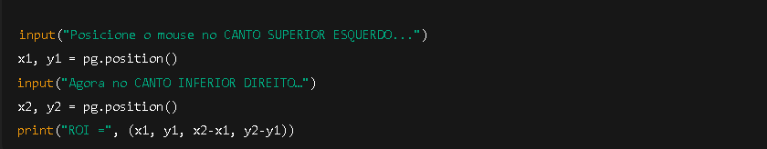
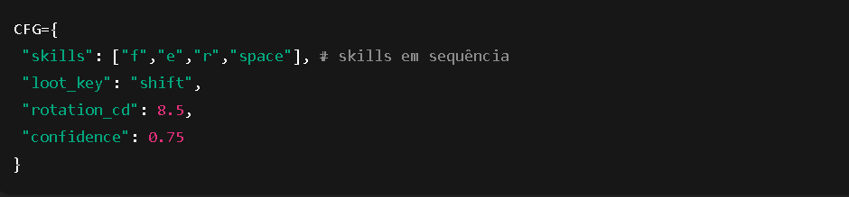

Esse script é um bot de automação em python para o jogo Black Desert Online (BDO), que tenta detectar mobs na tela com uma IA simples e executar habilidades, loot e  movimentação automaticamente.
  
Recomendaçoes de uso: ultilize o Python 13.11.8, dependendo se tiver dando erro de versão mude as variaveis ambiente do python, desative todos os sistema de segurança 
  
O que esse bot faz (em resumo)
  
Captura uma área da tela do jogo (ROI).
  
Usa uma rede neural (MobileNetV3) para tentar identificar se existe um mob na imagem.
  
Se detectar mob:
  
Executa uma rotação de skills.
  
Dá loot automaticamente.
  
Se não detectar:
  
Anda em padrões para não ficar AFK.
  
A cada tempo:
  
Faz manutenção (reparar tenda e alimentar pets).
  
Tudo é controlado por teclas globais:
  
F9 → liga/desliga o bot
  
ESC → encerra
    
. Seleção da área do jogo (ROI)

  
Isso serve para definir qual parte da tela será analisada pela IA (a área onde aparecem os mobs).
  
Depois essa área é usada no MSS:
 
mon={"top": CFG["roi"][1], "left": CFG["roi"][0],
     "width": CFG["roi"][2], "height": CFG["roi"][3]}
  
Configurações principais

  
Isso define:
 
Config	Função
 
skills	Teclas das habilidades
 
loot_key	Tecla de loot
 
rotation_cd	Tempo mínimo entre rotações
 
confidence	Quanto a IA precisa estar confiante para agir
  
Captura da tela
  
def screenshot(local_sct):
    img = np.array(local_sct.grab(mon))
    img = cv2.cvtColor(img, cv2.COLOR_BGRA2BGR)
    return img
 
Ele captura apenas a área do jogo, não a tela inteira.
  
5. IA: detector de mob
 
Ele cria uma rede neural baseada em MobileNetV3:
 
class MobNet(torch.nn.Module):
    ...
 
Ela retorna 1 valor entre 0 e 1:
 
score=net(x).item()
 
return score>CFG["confidence"], score
 

Ou seja:
 
“Essa imagem tem um mob? Sim/Não
 
⚠️ Importante:
Se o arquivo mob_detector.pt não existir, ele usa pesos aleatórios, ou seja:
 
A IA não funciona de verdade até ser treinada.
  
6. Lógica principal
 
if has_mob:
 
    self.fight()
     
else: 
    self.patrol()
     

fight() 
for k in CFG["skills"]: 
    send(k) 
loot() 

 
Ele aperta as skills em sequência e depois dá loot.
 
patrol() 
kb.press('w'); time.sleep(20.2) 
kb.press('a'); time.sleep(20.3) 

 
Ele anda para frente e para o lado → anti-AFK.
  
7. Controle por teclas 
if key==Key.f9: 
    farmer.start() if not farmer.running else farmer.stop() 

  
F9 → inicia / pausa o bot
 
ESC → encerra tudo
  